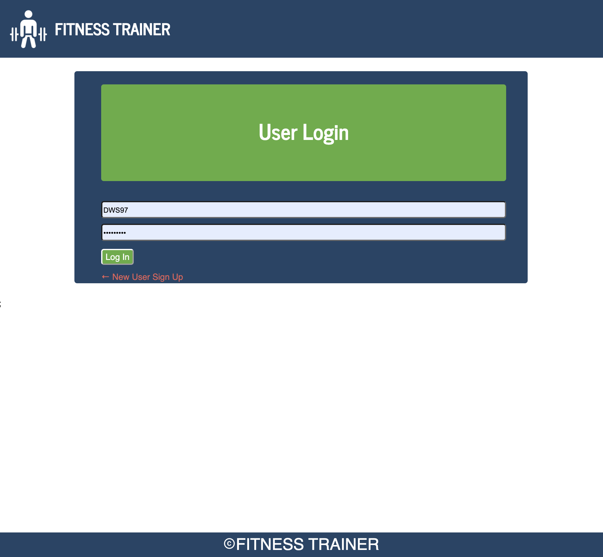
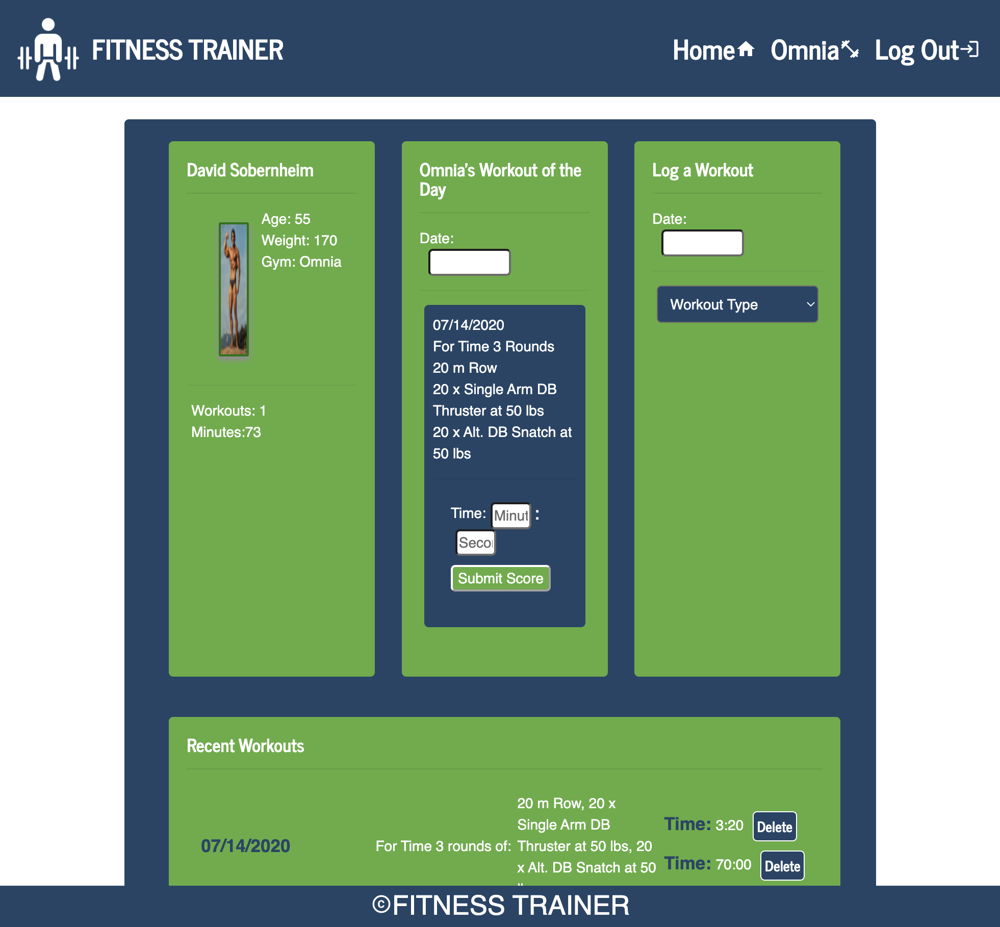
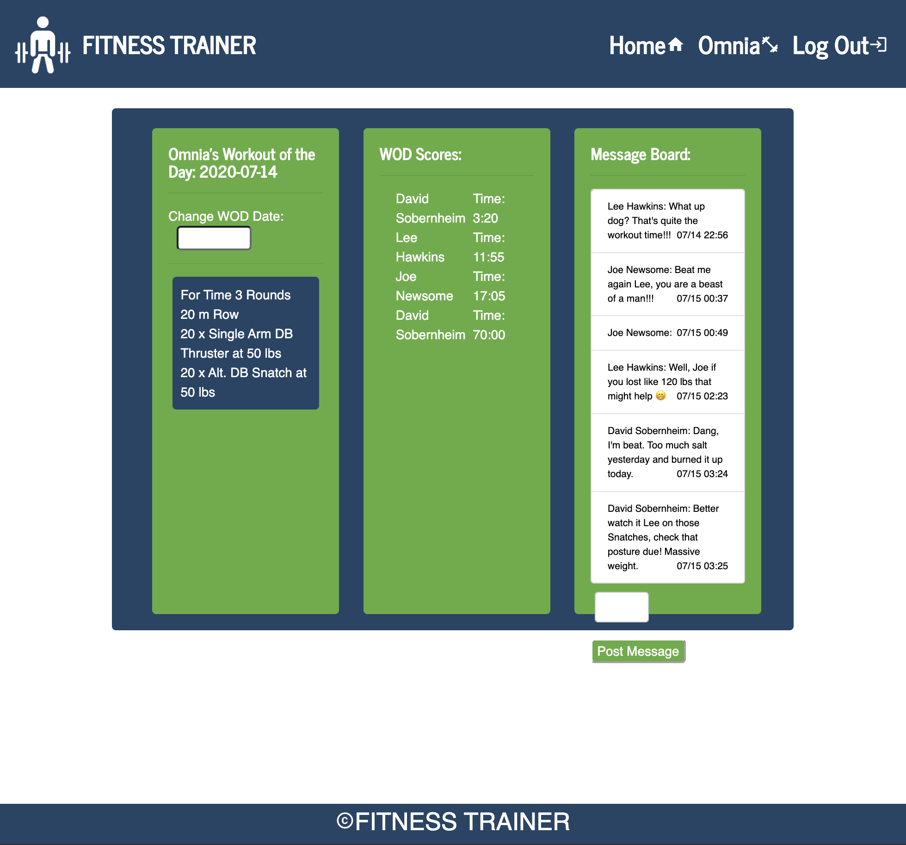

# Muscling

Our application helps cross-fit enthusiasts plan and comment on their fitness routines by obtaining workouts from their favorite gym and is deployed via Heroku.

One of our teammates is a cross-fit member and another has a family member who attends cross-fit.  We thought our application would help people plan their workouts and keep track of the workouts they have completed.  In addition, they can share their daily scores and compare their results to others. 

## Screen Shots


Introductory Screen


Workout Planning


Social Comms

## Technologies Used
- Node.js - https://nodejs.org/en/
- Handlebars - http://handlebarsjs.com/
- MongoDB - https://www.mongodb.com/download-center#community
- Mongoose - http://mongoosejs.com/docs/
- express NPM Package - https://www.npmjs.com/package/express
- express-handlebars NPM Package - https://www.npmjs.com/package/express-handlebars
- cheerio NPM Package - https://www.npmjs.com/package/cheerio
- react NPM Package - https://www.npmjs.com/package/react


### Prerequisites

```
- Node.js - Download the latest version of Node https://nodejs.org/en/
- React - Smooth and fluid with var React = require('react');
```

## Built With

* Visual Studio Code - Text Editor
* Node
* Mongoose/MongoDB
* Cheerio
* React
* Robomongo - Download the latest version https://robomongo.org/


## Authors

* Lee Hawkins - PM/Mongo, Routes
* Kamy Leeret - Front End
* Robert McCandless - User Authentication, Message Board
* Dave Sobernheim - Workout API's Research, Web Scraping


## Copyright 2020