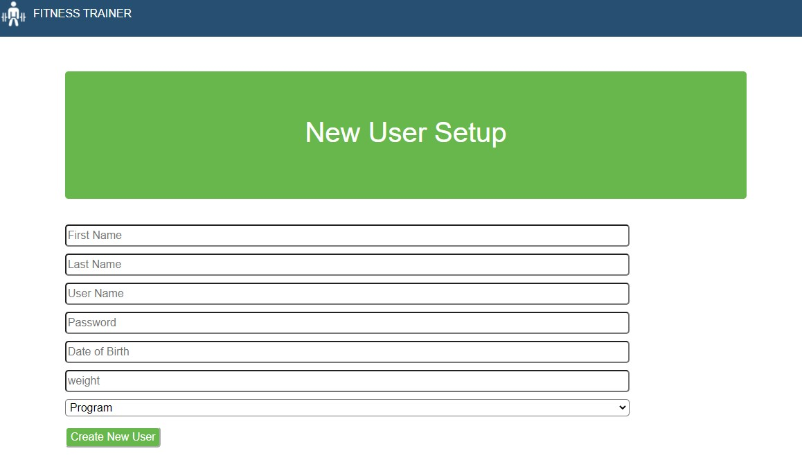
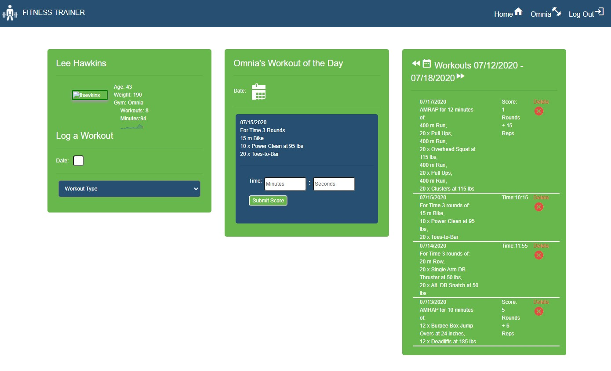
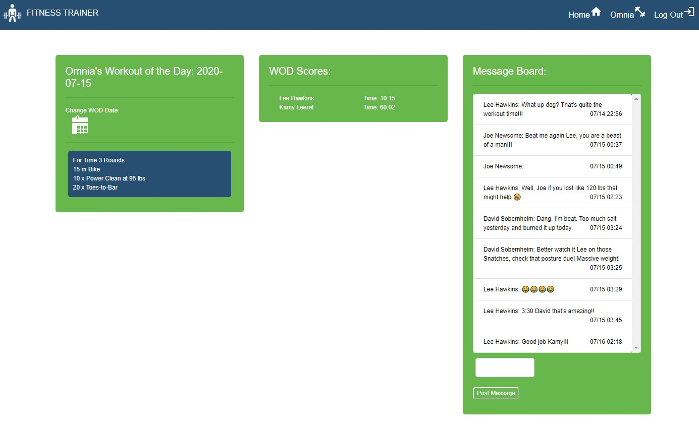

# Fitness-App

### Overview

The Fitness-App is a web application using the MERN (MongoDB,Expressjs,React,Nodejs) web development framework that allows users to track there workouts.

A user can register with their date of birth, weight, a profile picture and choose which gym they would like to join.  When they log in they are brought to a personal page, with personal their personal information, the workout of the day for the gym that they belong to (if it there is one) and a list of workouts completed by the user for the week.  If there is no workout of the day for the user's gym that day, the workout of the day is scraped from crossfit.com. The user can then enter the score, in time or reps based on the type of workout for their gym's workout of the day.  Or they can enter personal workout they have done with any number of exercises or rounds with a score.  The user can also scroll through previous weeks workouts they have completed or through their gym's workout of the days from previous days.

The user can also navigate to their gym's page using the navbar.  There they will find the gym's workout of the day, a list of all the scores for the workout of the day from all gym member's that completed the workout and a message board for handing out messages of encouragement or talking smack, user's choice.  The user can also look at previous workout's of the day and all the scores from members for that day.  

## Registration

## Log In

## User Home Page

## Gym Page

## Technologies Used
- React - Rendering of components, state control
- React Router - Routing
- Express.js - Server framework
- Axios NPM - Handling HTTP requests
- Mongoose ODM - Object model/Controllers
- Passport - Password encryption
- MongoDB - Database
- Bootstrap - styling
- Cheerio - Data scraping

## Authors

* Lee Hawkins - PM, Database, Models, Controllers, Routes 
* Kamy Leeret - Styling
* Robert McCandless - User Authentication, Message Board
* Dave Sobernheim - Workout API's Research, Web Scraping

## Copyright 2020